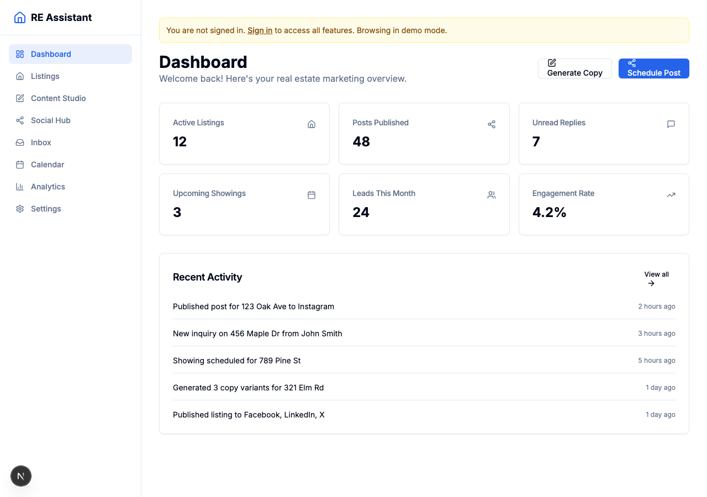

# Real Estate AI Assistant

AI-powered marketing assistant for US real estate agents. Generate listing copy, publish to social media, monitor engagement, and schedule showings — all from one dashboard.



## Features

- **Content Studio** — AI-generated marketing copy (social posts, listing descriptions, email blasts, video scripts, open house flyers) with Fair Housing Act compliance, 4 tone presets, and A/B variant generation
- **Social Publisher** — Cross-platform posting to Facebook, Instagram, TikTok, LinkedIn, X, and YouTube with optimal timing and media adaptation
- **Reply Monitor** — Unified inbox with AI intent classification (inquiry, showing request, price question, negotiation, spam, compliment), auto-responses, and lead scoring
- **Calendar Scheduler** — Google Calendar and Calendly integration with availability detection, geographic route optimization, and automated booking flows
- **Analytics Dashboard** — Engagement metrics, platform breakdown, lead tracking, and top-performing post rankings

## Tech Stack

| Layer | Technology |
|-------|-----------|
| Frontend | Next.js 15 (App Router), Tailwind CSS, shadcn/ui, Zustand |
| API | tRPC (type-safe), NextAuth.js |
| Database | PostgreSQL, Prisma ORM |
| Queue | BullMQ, Redis |
| AI | Anthropic Claude API, OpenClaw skills |
| Platforms | Facebook Graph API, Instagram Graph API, TikTok Content Posting API, LinkedIn Community Mgmt API, X API v2, YouTube Data API v3 |
| Calendar | Google Calendar API, Calendly API |
| Infra | Docker Compose, Turborepo, pnpm |

## Project Structure

```
realestate-ai-assistant/
├── apps/web/                    # Next.js SaaS frontend + API
│   ├── src/app/                 # Pages (dashboard, listings, content, social, inbox, calendar, analytics, settings)
│   ├── src/server/routers/      # tRPC API routers
│   ├── src/components/          # UI components (shadcn/ui)
│   └── prisma/                  # Database schema
├── packages/
│   ├── openclaw-skills/
│   │   ├── copywriter/          # Marketing copy generation
│   │   ├── social-publisher/    # Multi-platform posting
│   │   ├── reply-monitor/       # Engagement monitoring + auto-reply
│   │   └── calendar-scheduler/  # Availability + booking
│   ├── shared/                  # Shared types & interfaces
│   └── mls-client/              # MLS data client (RETS/Spark/Bridge)
└── infra/                       # Docker Compose, OpenClaw config
```

## Getting Started

### Prerequisites

- Node.js 20+
- pnpm 9+
- PostgreSQL 16
- Redis 7

### Setup

```bash
# Install dependencies
pnpm install

# Copy environment variables
cp .env.example .env
# Edit .env with your API keys and database URL

# Start PostgreSQL and Redis (via Docker)
docker compose -f infra/docker-compose.yml up postgres redis -d

# Run database migrations
cd apps/web && npx prisma migrate dev

# Generate Prisma client
npx prisma generate

# Start development server
cd ../.. && pnpm dev
```

The app will be available at http://localhost:3000.

### Environment Variables

See [`.env.example`](.env.example) for all required variables:

- `DATABASE_URL` — PostgreSQL connection string
- `REDIS_URL` — Redis connection string
- `NEXTAUTH_SECRET` — Auth session secret
- `ANTHROPIC_API_KEY` — For AI content generation
- Social media OAuth credentials (Facebook, Instagram, TikTok, LinkedIn, X, YouTube)
- Google Calendar / Calendly API keys

## Pages

| Route | Description |
|-------|-------------|
| `/dashboard` | Overview metrics, recent activity, quick actions |
| `/listings` | Property management, MLS import, content generation |
| `/content` | AI content studio with variant generation and preview |
| `/social` | Content calendar, post queue, platform connections |
| `/inbox` | Unified reply inbox with intent classification and auto-reply |
| `/calendar` | Appointment scheduling, availability, Google Calendar sync |
| `/analytics` | Performance metrics across all platforms |
| `/settings` | Profile, social accounts, calendar integration, AI preferences |

## License

MIT
